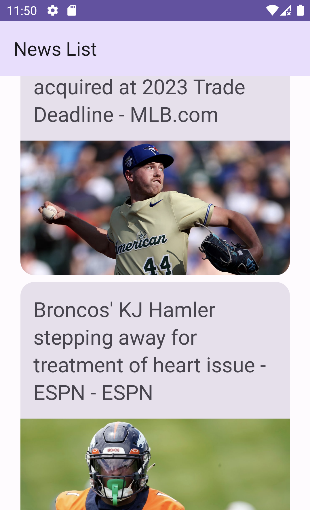
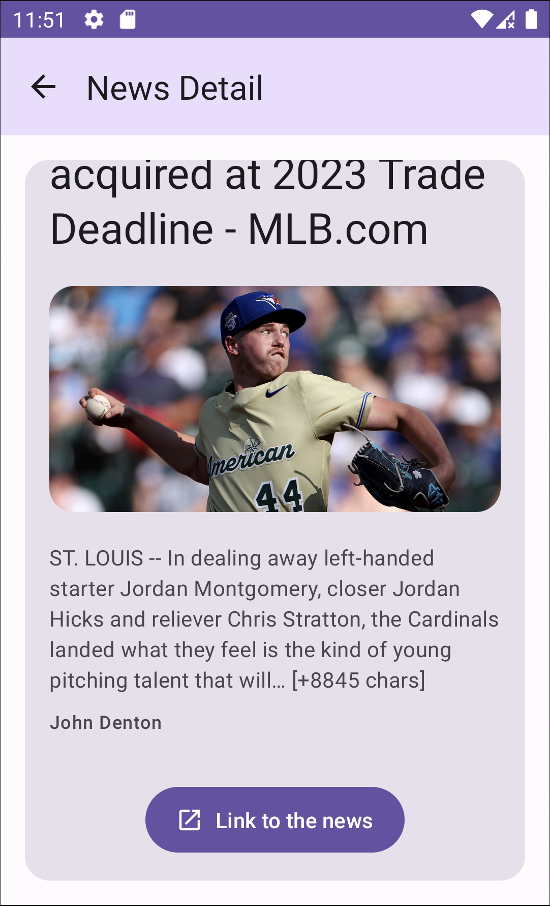

# News App

News app is an android application that allow users to read top headline news in their devide language.

 
 

<table>
  <tr>
    <td style="padding-right: 20px;">
      
    </td>
    <td>
      
    </td>
  </tr>
</table>

## Table of contents

- [Features](#features)
- [App Stack](#appstack)
- [Improvements](#improvements)
- [commentary](#commentary)
- [Duration](#duration)

## Features

- 🗞️ List View of News: Display a list of news articles in a scrollable view.
- 📰 News Detail Screen: Show the full news title, content, author and a picture associated with the article.
- 🔗 WebView Access: Allow users to access the full news content in an external browser.

## App Stack

- ### Kotlin

- ### MVVM
  - #### why ?
    - MVVM architechture made maintenability and testability easier
    - Reusability of code
    - Separation of concern
    - Readability

- ### Jetpack Compose
  - #### why ?
    - I'm actually learning compose so i wanted to use it this project even if the main goal of this test was to show my learned skills
    - Less code
    - no more need of XML so everything is writen in Kotlin
    - Much funnier to learn and practice than XML
    - Reusability of composable

- ### Hilt
  - #### why ?
    - Why Hilt over Koin for example ? simply because i've never used koin yet, so i was more comfortable to use hilt for the dependency injection but i've planned to test it on an actual personnal project
    
- ### Retrofit

- ### Navigation Compose
  - #### why ?
    - Easier way to manage navigation between screen and more readable

- ### Mockk

## Improvements

- Improve app design
- Make UIState to afford send data ui doesn't need
- Manage Offline Mode
- Replace DetailScreen by a webView to improve user experience
- Implement loading screen during loading api response

## Commentary

Actually News Api has some difficulty to manage with pictures article for french content but it work perfectly fine with english content

## Duration 

i've worked on this app approximately 16 Hours and passed the major time on learning how to manage with composable and compose navigation. 

